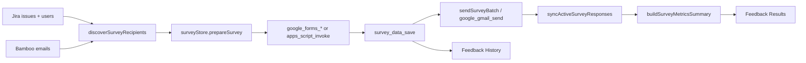

# Full functionality recovery audit (Phase 1)

**Date:** 2026-10-02  
**Purpose:** Compare old functional Jira App (read-only baseline) with current Metrio. No UI restore, no wholesale copy. Identify gaps for phased recovery.

## Repository verification

| Repo | Branch / HEAD | Notes |
|------|----------------|-------|
| **Metrio** (current) | `main` @ `f151cbf89df23eef64bef85a88b860161aef0b89` | Matches `origin/main`. Untracked: `src-tauri/*.ported` (not part of product). |
| **Jira App** (old, read-only) | Working tree `feature/figma-metrio-rebuild` @ `bbe6e09`; **baseline inspected:** `43baf2e2f27c3d8c36f622c72b955e4ca7253d51` | Baseline commit: packaged PDF export via native `write_user_selected_pdf`. Old repo not modified during this audit. |

**Entry route (Metrio):** `src/main.tsx` → `App.tsx` → `ConnectionScreen` | `AuthenticatedApp` → `AppLayout` → `PerformancePage` / `FeedbackPage` / `SettingsPage`.

**Entry route (old @ 43baf2e):** `src/main.tsx` → `BrowserRouter` → `src/app/AppShell.tsx` → `JiraPerformancePage` / Feedback / Settings; Zustand `src/app/store.ts` orchestrates Jira+Bamboo+snapshots+tray+notifications.

---

## Production fixture import graph (Metrio)

Performance pages **do not** import `src/fixtures/*` (enforced by `src/services/performance/performanceViewModel.test.ts`).

| Production file | Fixture import | Effect |
|-----------------|------------------|--------|
| `src/app/CurrentUserContext.tsx` | `fixtures/currentUsers` → `fixtures/people` | **DEV:** always fixture user. **PROD:** `buildCurrentUserFromTeamDetection`; if `productionUser === null`, falls back to `getFixtureUser("employee")` (should only occur before workspace ready / edge bootstrap). |

All other `src/fixtures/*` usage is limited to unit tests and fixture self-tests.

Synthetic MET-* keys, 84%/76% KPI, and “Monitoring baseline signals” live only in `src/fixtures/teamPerformance.ts` (not in live Performance path after `f151cbf`).

---

## Dependency comparison (package.json)

| Area | Old Jira App @ 43baf2e | Current Metrio | Recovery note |
|------|------------------------|----------------|---------------|
| PDF | `@react-pdf/renderer` | **Removed** | Required for Phase 5; Rust `write_user_selected_pdf` **present** |
| Routing | `react-router-dom` | **Removed** | Intentional: single-shell Metrio UI; person detail is drawer not `/person/:key` |
| State | `zustand` | **Removed** | Replaced by React context (`PerformanceDataContext`, connection/session contexts) |
| UI primitives | `@radix-ui/*` | **Removed** | Metrio uses custom `components/*` + `shell/*` |
| Fonts | `@fontsource/*` | **Removed** | Metrio tokens/CSS |
| Visual QA | `@playwright/test` + scripts | **Removed** | Optional for Phase 7 regression; not required for core product |
| Icons | — | `lucide-react` | New stack |
| Tauri plugins | autostart, dialog, fs, notification, opener | Same set | OK |
| Vitest | v5 + coverage | v3 | OK for current CI |

**Must return for parity:** `@react-pdf/renderer` (PDF export UI path).  
**Must return for full Feedback:** Google client stack is partly Rust-side in old app (`google_*`, `apps_script_*`, `survey_data_*` commands)—**removed from current `src-tauri`** (see Tauri section).

---

## Tauri / Rust comparison (@ 43baf2e vs current Metrio)

| Capability | Old @ 43baf2e | Current Metrio |
|------------|---------------|----------------|
| Credentials / prefs / logs | Yes | Yes |
| Jira HTTP commands | Yes | Yes |
| Bamboo HTTP commands | Yes | Yes |
| KPI snapshot file | `kpi_snapshot_load/save` | Yes |
| PDF write | `write_user_selected_pdf` | Yes |
| Tray install + menu + `update_tray_snapshot` | Yes | Yes (host) |
| Background emitters | Jira 30m, Bamboo 60m, **Survey 15m** | Jira 30m, Bamboo 60m (**no survey**) |
| Google OAuth / Forms / Gmail / Drive | Full command set | **Removed** |
| Apps Script bridge | `apps_script_*` | **Removed** |
| Survey persistence | `survey_data_load/save` | **Removed** (Rust constant `SURVEY_DATA_SCHEMA_VERSION` still in `persistence.rs`—dead) |
| Close → hide, Reopen → show | Yes | Yes |
| Autostart plugin | Yes | Yes (plugin registered; **TS not wired** from Settings) |

---

## Feedback workflow trace (old @ 43baf2e)

| Legacy Apps Script / GS | Old TS @ 43baf2e | Metrio today |
|-------------------------|------------------|--------------|
| `runReporterSurveySearch` | `recipientDiscovery.ts`, `domain/survey/jql.ts`, `recipients.ts`, `surveyStore.prepareSurvey` | **MISSING** (no `domain/survey`, no `services/survey`, no `surveyStore`) |
| `createOrUpdateSurveyForm` | `surveyFormService.ts`, `googleSurveyClient.ts`, `appsScriptSurveyClient.ts` | **MISSING** + Rust commands removed |
| `sendSurveyEmails` | `surveyStore.sendSurveyBatch`, `emailTemplate.ts`, Gmail/Apps Script | **MISSING** |
| `buildSurveyResultsSummary` | `domain/survey/metrics.ts`, `FeedbackResultsView.tsx` | **MISSING**; UI placeholder only |

**Metrio:** `src/pages/FeedbackPage.tsx` — subnav + static empty copy; gated by `featureGates.isFeedbackEnabled()` (default **off** unless localStorage flag set in tests).

---

## Feature matrix (A–AL)

States: **FW** Fully wired · **PNW** Ported not wired · **PW** Partially wired · **FX** Fixture/mock only · **PH** Placeholder UI · **MS** Missing · **IR** Intentionally removed

| ID | Feature | Old source (@ 43baf2e) | Current source | State | Missing wiring / deps | Risk | Phase |
|----|---------|------------------------|----------------|-------|------------------------|------|-------|
| A | Auth / credentials | `store.ts`, `FirstRunPage`, `secureStorage`, Rust credentials | `connectAndContinue.ts`, `connectionStorage.ts`, `ConnectionScreen.tsx`, `secureStorage.ts` | **FW** | — | Low | — |
| B | Jira integration | `jiraClient.ts`, `domain/jira/*`, Rust `jira_*` | Same domain + `services/jira/jiraClient.ts`, Rust | **FW** (performance path) | Not used from Feedback (no survey JQL) | Low | 6 |
| C | Bamboo integration | `bambooClient.ts`, `orgResolver`, Rust `bamboo_*` | Same services + Rust | **FW** | Settings “Test Bamboo” not hooked | Low | 4 |
| D | Team / role detection | `teamDetection`, `orgResolver`, prefs | `teamDetection.ts`, `teamScope.ts`, `fromTeamDetection.ts` | **FW** | — | Low | — |
| E | Performance Overview | `JiraPerformancePage`, `TeamOverviewView`, `store.runReport` | `TeamOverviewView.tsx`, `performanceViewModel.ts`, `performanceDataService.ts` | **PW** | No weekly digest block; review target toolbar unused; no separate “team trends” tab (embedded cards only) | Med | 3 |
| F | People | `TeamPeopleTable` in `JiraPerformancePage` | `TeamPeopleView.tsx` | **FW** | — | Low | — |
| G | Radar | `TeamRadarView`, `buildTeamRadar` | `TeamRadarView.tsx`, `domain/radar/teamRadar.ts` | **FW** | Empty state OK | Low | — |
| H | Delivery Risk | `DeliveryRiskView`, `buildDeliveryRiskItems` | `TeamDeliveryRiskView.tsx` | **FW** | — | Low | — |
| I | Person detail | `PersonDetailPage`, drawer, one-on-one | `PersonDetailDrawer.tsx` | **PW** | No dedicated route; **no One-on-one prep** (`domain/one-on-one` **MS** in Metrio) | Med | 3 |
| J | Employee / personal mode | Personal tabs, scope in `store` | `EmployeePerformanceOverview.tsx`, scope in `performanceDataService` | **FW** | — | Low | — |
| K | My Week | Tab `MyWeekView`, tray | `buildMyWeek` in VM attention only; **no My Week tab** | **PW** | Tray/orphan; not a first-class tab | Med | 3 |
| L | Trends | Team/personal trend views, snapshots | Trend cards in overview/employee; `trendEngine` + snapshots on fetch | **PW** | **No** `runHistoricalBootstrap`; shallow history | Med | 3 |
| M | Work History | Tab + person history; **historyReportData** | Employee + drawer history from **same** report params | **PW** | Old app used wider history fetch | Med | 3 |
| N | Historical bootstrap | `historicalBootstrap.ts`, banner in Performance | `services/history/historicalBootstrap.ts` | **PNW** | Never called from `PerformanceDataContext` / fetch | Med | 3 |
| O | KPI snapshots | `recordDailySnapshots`, Rust KPI file | Same; called from `performanceDataService.ts` | **FW** | — | Low | — |
| P | Workload | `workloadEngine`, `WorkloadBalanceView` | Overview table via `buildWorkloadBalance` | **FW** | — | Low | — |
| Q | Time off / availability | `syncBambooAvailability`, who's out | Bamboo in `fetchPerformanceData`; `domain/people/availability` | **FW** | No dedicated “Upcoming vacation” section title (data in time off list) | Low | 3 |
| R | Refresh | `store.refreshAll` | `PerformanceDataContext.refresh` | **FW** | — | Low | — |
| S | Background refresh | Rust emitters + `AppShell` listeners | Rust emitters + `PerformanceDataContext` | **PW** | No survey sync event | Low | 4 |
| T | Tray | `platform/tray.ts` ← `store` | Rust tray; `platform/tray.ts` | **PW** | **`updateTrayFromSnapshot` never called** | Med | 4 |
| U | Notifications | `notifications.ts` ← `runReport` | `platform/notifications.ts` | **PNW** | Prefs toggles in Settings only | Med | 4 |
| V | Settings | Full settings sections | `SettingsPage.tsx` | **PW** | Test connections, autostart, Google panel missing | Med | 4–6 |
| W | Connection diagnostics | `connectionHealth`, diagnostics export | `connectionHealth.ts` (orphan), simplified export in Settings | **PW** | Rich `diagnosticsExport.ts` excluded from tsconfig | Med | 4 |
| X | PDF Export | `features/export/*`, Performance sticky export | `services/export/*`, Rust PDF | **PNW** | No UI; `@react-pdf/renderer` removed; pdf TS excluded from tsconfig | Med | 5 |
| Y | Feedback Survey | `FeedbackPage`, `surveyStore.prepareSurvey` | `FeedbackPage.tsx` placeholder | **PH** | Entire survey stack **MS** | **High** | 6 |
| Z | Feedback Delivery | `FeedbackDeliveryView`, send batch | Placeholder copy | **PH** | **MS** | **High** | 6 |
| AA | Feedback Results | `FeedbackResultsView`, metrics | Placeholder copy | **PH** | **MS** | **High** | 6 |
| AB | Feedback History | `FeedbackHistoryView`, `survey_data_*` | Placeholder copy | **PH** | Rust store removed | **High** | 6 |
| AC | Google Forms | Rust `google_forms_*`, form service | — | **MS** | Rust + TS removed | **High** | 6 |
| AD | Gmail / survey email | `google_gmail_send`, templates | — | **MS** | — | **High** | 6 |
| AE | Google OAuth / Apps Script | `apps_script_*`, `google_oauth_*`, `config/google.ts` | `config/google.ts`, prefs shape only | **PNW** | No UI, no Rust commands | **High** | 6 |
| AF | Dark/light theme | Profile + `platform/theme.ts` | `theme/ThemeProvider.tsx`, Settings, ProfileMenu | **FW** | — | Low | — |
| AG | Motion | `metrio-motion.css`, MotionSurface | `styles/motion.test.ts`, CSS tokens | **PW** | Less surface area than old Figma shell | Low | 7 |
| AH | Close-to-tray / reopen | `lib.rs` hide on close | Same | **FW** | `keepRunningInTray` pref not read in Rust (same as old @ 43baf2e) | Low | 4 |
| AI | Launch at login | `autostart.ts` + Settings | `platform/autostart.ts` + Settings checkbox | **PNW** | Checkbox does not call `applyLaunchAtLogin` | Low | 4 |
| AJ | Logging / diagnostics | `logger.ts`, `diagnosticsExport`, Rust logs | `logger.ts`, boot diagnostics, Rust logs | **PW** | Full diagnostics bundle not wired | Med | 4 |
| AK | Local persistence | prefs, KPI, survey JSON | prefs + KPI via invoke; **no survey file** | **PW** | Survey persistence **MS** | Med | 6 |
| AL | Packaged-app behavior | Tray, background, PDF path guard, legacy import | Same except survey/Google | **PW** | Feedback/sync gap | Med | 4–7 |

---

## Orphaned production code (Metrio)

Reachable from tests or dead imports only—not from `AuthenticatedApp` → `AppLayout` → pages.

| Module | Path | Old equivalent | Recovery |
|--------|------|----------------|----------|
| Tray updater | `src/platform/tray.ts` | Called after every `runReport` | Wire after `fetchPerformanceData` (Phase 4) |
| PDF pipeline | `src/services/export/buildPerformanceExportData.ts`, `pdfExport.tsx` (excluded), `PdfReportDocument.tsx` | Performance export button | Phase 5 + restore dependency |
| Historical bootstrap | `src/services/history/historicalBootstrap.ts` | Post-report background job | Phase 3 after performance stable |
| Notifications engine | `src/platform/notifications.ts` | After `runReport` | Phase 4 |
| Connection health pill | `src/platform/connectionHealth.ts` | Header health | Phase 4 |
| Jira refresh errors UX | `src/platform/jiraRefreshErrors.ts` | Refresh error mapping | Phase 3–4 |
| Autostart | `src/platform/autostart.ts` | Settings toggle | Phase 4 |
| Rich diagnostics | `src/platform/diagnosticsExport.ts` (tsconfig exclude) | Advanced settings | Phase 4 (fix survey type deps or split) |
| Weekly digest / export-only domain | `domain/digests/weeklyDigest.ts`, `domain/trends/teamTrendHistory.ts` | Overview digest | Phase 3 UI or Phase 5 PDF |
| Telemetry / clipboard | `platform/telemetry.ts`, `platform/clipboard.ts` | Minor utilities | Phase 7 if needed |
| Fixture performance generators | `fixtures/teamPerformance.ts`, etc. | N/A | Keep for tests/dev gallery only |
| Dead shell | `app/ProductShellPlaceholder.tsx` | — | Delete in Phase 7 cleanup |

**Still wired (not orphaned):** `JiraClient`, `BambooClient`, `buildTeamSnapshot`, `buildTeamRadar`, `buildDeliveryRiskItems`, `buildMyWeek`, `buildWorkHistory`, snapshot persistence, trend engine (via fetch + VM).

---

## Do not port (obsolete / intentionally replaced)

| Item | Reason |
|------|--------|
| Old `AppShell` + `react-router` multi-route Performance | Metrio single-shell design is intentional |
| Zustand `store.ts` monolith | Replaced by explicit services + contexts |
| Old Figma `src/ui/aiva/*` component tree | New Metrio components (`components/`, `shell/`) |
| `src/visual-fixture` Playwright pixel baselines | Rebuild QA in Phase 7 if needed, not copy paths |
| Legacy ReporterSurvey.gs as runtime | Replace with port of TS workflow + Apps Script companion |
| Duplicate app-level `AppHeader` / `ThemeProvider` | Use `shell/MetrioAppHeader` + `theme/ThemeProvider` |
| Fake Performance fixture path in production | Already removed @ `f151cbf`; keep fixtures test-only |

---

## Summary counts (matrix A–AL, 38 features)

| State | Count |
|-------|------:|
| FULLY WIRED | 14 |
| PARTIALLY WIRED | 13 |
| PORTED BUT NOT WIRED | 6 |
| PLACEHOLDER UI | 4 |
| FIXTURE / MOCK ONLY | 0 (production Performance path) |
| MISSING | 0 standalone rows* |
| INTENTIONALLY REMOVED | 1 (router/zustand/old shell — folded into “do not port”) |

\*Several **MISSING** sub-capabilities (survey, Google Rust, one-on-one) are embedded in **PH/PNW/MS** rows Y–AE and I/K/L/M/N.

**Fixture/mock in production:** 1 narrow path (`CurrentUserContext` prod fallback + dev fixtures).

**Dependencies to restore:** `@react-pdf/renderer` (PDF); full Feedback requires restoring Rust Google/Apps Script/survey commands from old `src-tauri` (see `docs/phase8-port-audit.md`).

**Highest-risk restoration:** Feedback end-to-end (Jira recipients → Forms → Gmail/Apps Script → sync → metrics) and Google credential lifecycle; PDF export second (dependency + tsconfig + UI hook).

---

## Ordered recovery plan (do not start Phase 2 in Phase 1)

### Phase 2 — Real Performance data foundation
- Harden `performanceDataService` (identity matching, partial states, manager scope).
- Remove prod reliance on `getFixtureUser` fallback when workspace ready.
- Align `reviewTarget` toolbar with report params or document as display-only.

### Phase 3 — Complete Performance functionality
- Wire `runHistoricalBootstrap` + UI banner/progress.
- Separate history date range if parity with old `historyReportData` required.
- Optional My Week tab or explicit section for employee mode.
- Person drawer: task detail depth, one-on-one prep port if still in scope.
- Overview: weekly digest / team trends parity without redesigning layout.

### Phase 4 — Runtime integrations and native behavior
- Call `updateTrayFromSnapshot` after successful fetch.
- Wire `processNotificationTransitions` + Settings toggles.
- Wire `applyLaunchAtLogin`, connection test buttons, `connectionHealth` in header.
- Rich diagnostics export or trim excluded module.

### Phase 5 — PDF export
- Add `@react-pdf/renderer`; re-include export TS in tsconfig.
- Performance export entry (toolbar/sticky) → `exportPerformancePdf` → `write_user_selected_pdf`.

### Phase 6 — Feedback workflow
- Restore Rust: `survey_data_*`, `google_*`, `apps_script_*` (from old repo @ 43baf2e+).
- Port `domain/survey/*`, `services/survey/*`, `surveyStore` (or equivalent) to Metrio architecture.
- Replace `FeedbackPage` placeholders with real Survey/Delivery/Results/History.

### Phase 7 — Packaged regression and cleanup
- Packaged manual QA checklist (Performance, tray, PDF, Feedback).
- Optional Playwright smoke; remove dead placeholders (`ProductShellPlaceholder`).
- Document `featureGates` for Feedback enablement in production builds.

---

## Validation (Phase 1 — no product code changes)

| Check | Result |
|-------|--------|
| `npm test` | 274 passed |
| `npm run build` | OK |
| `cargo check --manifest-path src-tauri/Cargo.toml` | OK |

---

## References

- Prior port notes: `docs/phase8-port-audit.md`
- Auth spec: `docs/auth-phase-spec.md`
- Old baseline commit inspected via `git show 43baf2e:…` in Jira App repo
