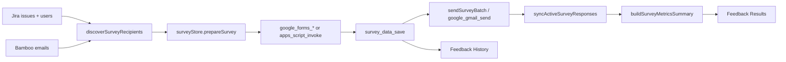

# Full functionality recovery audit (Phase 1 + Phase 7 refresh)

**Date:** 2026-10-02 (Phase 7 acceptance refresh)  
**Purpose:** Compare old functional Jira App (read-only baseline) with current Metrio. Phase 7 re-checked all PNW/PW/PH/MS items after Phases 2–6.

**Acceptance record:** `docs/full-functionality-recovery-acceptance.md`

## Repository verification (Phase 7)

| Repo | Branch / HEAD | Notes |
|------|----------------|-------|
| **Metrio** (current) | `main` @ `7ae63df571a205fa6c5c0528f983ecd3dfde85e2` → Phase 7 commit pending | Phases 3–6 landed on main before Phase 7. |
| **Jira App** (old, read-only) | Baseline `43baf2e2f27c3d8c36f622c72b955e4ca7253d51` | Unchanged reference. |

**Entry route (Metrio):** `src/main.tsx` → `App.tsx` → `ConnectionScreen` | `AuthenticatedApp` → `AppLayout` → `PerformancePage` / `FeedbackPage` / `SettingsPage`.

**Entry route (old @ 43baf2e):** `src/main.tsx` → `BrowserRouter` → `src/app/AppShell.tsx` → `JiraPerformancePage` / Feedback / Settings; Zustand `src/app/store.ts`.

---

## Phase 7 re-check summary (was PNW / PW / PH / MS)

| Former state | Feature IDs | Phase 7 status |
|--------------|-------------|----------------|
| **PH / MS** | Y, Z, AA, AB, AC, AD, AE | **RESTORED** — full Feedback stack + Rust Google/Apps Script/survey store @ Phase 6 |
| **PNW** | N, U, X, AI | **RESTORED** — bootstrap, notifications, PDF export, autostart sync |
| **PNW** | W (rich diagnostics) | **NOT RESTORED** — simplified Settings export only |
| **PW** | E, I, K, L, M, S, T, V, AJ, AK, AL | Mostly **RESTORED**; see acceptance doc for one-on-one, digest UI, survey background listener |
| **Fixture path** | Production user | **RESTORED** — prod uses Bamboo team detection only; fixtures DEV-only |

---

## Production fixture import graph (Metrio) — Phase 7

Performance pages **do not** import `src/fixtures/*` (enforced by `src/services/performance/performanceViewModel.test.ts`).

| Production file | Fixture import | Effect |
|-----------------|----------------|--------|
| `src/app/CurrentUserContext.tsx` | Dynamic `fixtures/currentUsers` | **DEV only.** Production resolves user from Bamboo `teamDetection` (no fixture user). |

All other `src/fixtures/*` usage: unit tests and DEV profile fixture switcher.

Synthetic MET-* keys and “Monitoring baseline signals” remain only in `src/fixtures/teamPerformance.ts` and are absent from production `dist/` bundles.

---

## Dependency comparison (package.json)

| Area | Old Jira App @ 43baf2e | Current Metrio (Phase 7) | Recovery note |
|------|------------------------|---------------------------|---------------|
| PDF | `@react-pdf/renderer` | **Present** | Phase 5 — `PerformanceExportContext` |
| Routing | `react-router-dom` | **Removed** | Intentional: Metrio shell |
| State | `zustand` | **Present** (Feedback store only) | Performance uses contexts; Feedback uses `feedbackSurveyStore` |
| UI primitives | `@radix-ui/*` | **Removed** | Metrio uses custom `components/*` + `shell/*` |
| Fonts | `@fontsource/*` | **Removed** | Metrio tokens/CSS |
| Visual QA | `@playwright/test` + scripts | **Removed** | Optional for Phase 7 regression; not required for core product |
| Icons | — | `lucide-react` | New stack |
| Tauri plugins | autostart, dialog, fs, notification, opener | Same set | OK |
| Vitest | v5 + coverage | v3 | OK for current CI |

**Phase 7:** PDF and full Feedback/Google stacks are restored on `main`. See acceptance doc for per-feature disposition.

---

## Tauri / Rust comparison (@ 43baf2e vs current Metrio)

| Capability | Old @ 43baf2e | Current Metrio |
|------------|---------------|----------------|
| Credentials / prefs / logs | Yes | Yes |
| Jira HTTP commands | Yes | Yes |
| Bamboo HTTP commands | Yes | Yes |
| KPI snapshot file | `kpi_snapshot_load/save` | Yes |
| PDF write | `write_user_selected_pdf` | Yes |
| Tray install + menu + `update_tray_snapshot` | Yes | Yes (host) |
| Background emitters | Jira 30m, Bamboo 60m, **Survey 15m** | Jira 30m, Bamboo 60m, **Survey 15m** |
| Google OAuth / Forms / Gmail / Drive | Full command set | **Restored** |
| Apps Script bridge | `apps_script_*` | **Restored** |
| Survey persistence | `survey_data_load/save` | **Restored** |
| Close → hide, Reopen → show | Yes | Yes |
| Autostart plugin | Yes | Yes — Settings → `syncGeneralPreferencesToNative` |

---

## Feedback workflow trace (old @ 43baf2e)

| Legacy Apps Script / GS | Old TS @ 43baf2e | Metrio Phase 7 |
|-------------------------|------------------|----------------|
| `runReporterSurveySearch` | `recipientDiscovery.ts`, … | **RESTORED** |
| `createOrUpdateSurveyForm` | `surveyFormService.ts`, … | **RESTORED** |
| `sendSurveyEmails` | `sendSurveyBatch`, templates | **RESTORED** |
| `buildSurveyResultsSummary` | `metrics.ts`, Results view | **RESTORED** |

**Metrio:** `src/pages/FeedbackPage.tsx` → `FeedbackTeamProvider` + `src/pages/feedback/FeedbackPage.tsx` (Survey / Delivery / Results / History).

---

## Feature matrix (A–AL) — Phase 7 states

Historical Phase 1 states below are **superseded** for recovery tracking by `docs/full-functionality-recovery-acceptance.md` (RESTORED / REPLACED / REMOVED / NOT RESTORED).

Quick Phase 7 mapping:

| IDs | Phase 1 gap | Phase 7 |
|-----|-------------|---------|
| N, U, X, AI, T, O, R | PNW / PW | RESTORED |
| Y–AE | PH / MS | RESTORED (Feedback + Google) |
| I | one-on-one | NOT RESTORED (drawer RESTORED) |
| W | rich diagnostics | NOT RESTORED |
| E | weekly digest block | NOT RESTORED (overview RESTORED) |
| S | survey background UI listener | NOT RESTORED (Rust emitter only) |
| AG | motion surface | INTENTIONALLY REPLACED |

Phase 1 matrix snapshot (archival)

States: **FW** Fully wired · **PNW** Ported not wired · **PW** Partially wired · **FX** Fixture/mock only · **PH** Placeholder UI · **MS** Missing · **IR** Intentionally removed

| ID | Feature | Old source (@ 43baf2e) | Current source | State | Missing wiring / deps | Risk | Phase |
|----|---------|------------------------|----------------|-------|------------------------|------|-------|
| A | Auth / credentials | `store.ts`, `FirstRunPage`, `secureStorage`, Rust credentials | `connectAndContinue.ts`, `connectionStorage.ts`, `ConnectionScreen.tsx`, `secureStorage.ts` | **FW** | — | Low | — |
| B | Jira integration | `jiraClient.ts`, `domain/jira/*`, Rust `jira_*` | Same domain + `services/jira/jiraClient.ts`, Rust | **FW** (performance path) | Not used from Feedback (no survey JQL) | Low | 6 |
| C | Bamboo integration | `bambooClient.ts`, `orgResolver`, Rust `bamboo_*` | Same services + Rust | **FW** | Settings “Test Bamboo” not hooked | Low | 4 |
| D | Team / role detection | `teamDetection`, `orgResolver`, prefs | `teamDetection.ts`, `teamScope.ts`, `fromTeamDetection.ts` | **FW** | — | Low | — |
| E | Performance Overview | `JiraPerformancePage`, `TeamOverviewView`, `store.runReport` | `TeamOverviewView.tsx`, `performanceViewModel.ts`, `performanceDataService.ts` | **PW** | No weekly digest block; review target toolbar unused; no separate “team trends” tab (embedded cards only) | Med | 3 |
| F | People | `TeamPeopleTable` in `JiraPerformancePage` | `TeamPeopleView.tsx` | **FW** | — | Low | — |
| G | Radar | `TeamRadarView`, `buildTeamRadar` | `TeamRadarView.tsx`, `domain/radar/teamRadar.ts` | **FW** | Empty state OK | Low | — |
| H | Delivery Risk | `DeliveryRiskView`, `buildDeliveryRiskItems` | `TeamDeliveryRiskView.tsx` | **FW** | — | Low | — |
| I | Person detail | `PersonDetailPage`, drawer, one-on-one | `PersonDetailDrawer.tsx` | **PW** | No dedicated route; **no One-on-one prep** (`domain/one-on-one` **MS** in Metrio) | Med | 3 |
| J | Employee / personal mode | Personal tabs, scope in `store` | `EmployeePerformanceOverview.tsx`, scope in `performanceDataService` | **FW** | — | Low | — |
| K | My Week | Tab `MyWeekView`, tray | `buildMyWeek` in VM attention only; **no My Week tab** | **PW** | Tray/orphan; not a first-class tab | Med | 3 |
| L | Trends | Team/personal trend views, snapshots | Trend cards in overview/employee; `trendEngine` + snapshots on fetch | **PW** | **No** `runHistoricalBootstrap`; shallow history | Med | 3 |
| M | Work History | Tab + person history; **historyReportData** | Employee + drawer history from **same** report params | **PW** | Old app used wider history fetch | Med | 3 |
| N | Historical bootstrap | `historicalBootstrap.ts`, banner in Performance | `services/history/historicalBootstrap.ts` | **PNW** | Never called from `PerformanceDataContext` / fetch | Med | 3 |
| O | KPI snapshots | `recordDailySnapshots`, Rust KPI file | Same; called from `performanceDataService.ts` | **FW** | — | Low | — |
| P | Workload | `workloadEngine`, `WorkloadBalanceView` | Overview table via `buildWorkloadBalance` | **FW** | — | Low | — |
| Q | Time off / availability | `syncBambooAvailability`, who's out | Bamboo in `fetchPerformanceData`; `domain/people/availability` | **FW** | No dedicated “Upcoming vacation” section title (data in time off list) | Low | 3 |
| R | Refresh | `store.refreshAll` | `PerformanceDataContext.refresh` | **FW** | — | Low | — |
| S | Background refresh | Rust emitters + `AppShell` listeners | Rust emitters + `PerformanceDataContext` | **PW** | No survey sync event | Low | 4 |
| T | Tray | `platform/tray.ts` ← `store` | Rust tray; `platform/tray.ts` | **PW** | **`updateTrayFromSnapshot` never called** | Med | 4 |
| U | Notifications | `notifications.ts` ← `runReport` | `platform/notifications.ts` | **PNW** | Prefs toggles in Settings only | Med | 4 |
| V | Settings | Full settings sections | `SettingsPage.tsx` | **PW** | Test connections, autostart, Google panel missing | Med | 4–6 |
| W | Connection diagnostics | `connectionHealth`, diagnostics export | `connectionHealth.ts` (orphan), simplified export in Settings | **PW** | Rich `diagnosticsExport.ts` excluded from tsconfig | Med | 4 |
| X | PDF Export | `features/export/*`, Performance sticky export | `services/export/*`, Rust PDF | **PNW** | No UI; `@react-pdf/renderer` removed; pdf TS excluded from tsconfig | Med | 5 |
| Y | Feedback Survey | `FeedbackPage`, `surveyStore.prepareSurvey` | `FeedbackPage.tsx` placeholder | **PH** | Entire survey stack **MS** | **High** | 6 |
| Z | Feedback Delivery | `FeedbackDeliveryView`, send batch | Placeholder copy | **PH** | **MS** | **High** | 6 |
| AA | Feedback Results | `FeedbackResultsView`, metrics | Placeholder copy | **PH** | **MS** | **High** | 6 |
| AB | Feedback History | `FeedbackHistoryView`, `survey_data_*` | Placeholder copy | **PH** | Rust store removed | **High** | 6 |
| AC | Google Forms | Rust `google_forms_*`, form service | — | **MS** | Rust + TS removed | **High** | 6 |
| AD | Gmail / survey email | `google_gmail_send`, templates | — | **MS** | — | **High** | 6 |
| AE | Google OAuth / Apps Script | `apps_script_*`, `google_oauth_*`, `config/google.ts` | `config/google.ts`, prefs shape only | **PNW** | No UI, no Rust commands | **High** | 6 |
| AF | Dark/light theme | Profile + `platform/theme.ts` | `theme/ThemeProvider.tsx`, Settings, ProfileMenu | **FW** | — | Low | — |
| AG | Motion | `metrio-motion.css`, MotionSurface | `styles/motion.test.ts`, CSS tokens | **PW** | Less surface area than old Figma shell | Low | 7 |
| AH | Close-to-tray / reopen | `lib.rs` hide on close | Same | **FW** | `keepRunningInTray` pref not read in Rust (same as old @ 43baf2e) | Low | 4 |
| AI | Launch at login | `autostart.ts` + Settings | `platform/autostart.ts` + Settings checkbox | **PNW** | Checkbox does not call `applyLaunchAtLogin` | Low | 4 |
| AJ | Logging / diagnostics | `logger.ts`, `diagnosticsExport`, Rust logs | `logger.ts`, boot diagnostics, Rust logs | **PW** | Full diagnostics bundle not wired | Med | 4 |
| AK | Local persistence | prefs, KPI, survey JSON | prefs + KPI via invoke; **no survey file** | **PW** | Survey persistence **MS** | Med | 6 |
| AL | Packaged-app behavior | Tray, background, PDF path guard, legacy import | Same except survey/Google | **PW** | Feedback/sync gap | Med | 4–7 |

---

## Orphaned production code (Metrio) — Phase 7

Previously orphaned modules **now wired:**

| Module | Wired from |
|--------|------------|
| `platform/tray.ts` | `performanceRefreshSideEffects.ts` after fetch |
| `platform/notifications.ts` | Same side-effects path |
| `platform/autostart.ts` | `generalPreferencesSync.ts` on boot + Settings |
| `services/export/*` | `PerformanceExportContext` |
| `services/history/historicalBootstrap.ts` | `performanceDataService.ts` |
| `shell/ConnectionHealthBadge.tsx` | `MetrioAppHeader` |

Still not in main UI path:

| Module | Notes |
|--------|--------|
| `platform/diagnosticsExport.ts` | Excluded from tsconfig; not wired to Settings |
| `domain/digests/weeklyDigest.ts` | No overview UI block |
| `app/FoundationDevApp.tsx`, `Playground.tsx` | DEV gallery only |

**Removed Phase 7:** `app/ProductShellPlaceholder.tsx` (unused).

---

## Do not port (obsolete / intentionally replaced)

| Item | Reason |
|------|--------|
| Old `AppShell` + `react-router` multi-route Performance | Metrio single-shell design is intentional |
| Zustand `store.ts` monolith | Replaced by explicit services + contexts |
| Old Figma `src/ui/aiva/*` component tree | New Metrio components (`components/`, `shell/`) |
| `src/visual-fixture` Playwright pixel baselines | Rebuild QA in Phase 7 if needed, not copy paths |
| Legacy ReporterSurvey.gs as runtime | Replace with port of TS workflow + Apps Script companion |
| Duplicate app-level `AppHeader` / `ThemeProvider` | Use `shell/MetrioAppHeader` + `theme/ThemeProvider` |
| Fake Performance fixture path in production | Already removed @ `f151cbf`; keep fixtures test-only |

---

## Summary counts (Phase 7 acceptance)

See **`docs/full-functionality-recovery-acceptance.md`** for authoritative counts:

| Disposition | Count (A–AL) |
|-------------|-------------:|
| RESTORED | 29 |
| INTENTIONALLY REPLACED | 4 |
| INTENTIONALLY REMOVED | 3 |
| NOT RESTORED | 2 |

**Fixture/mock in production:** DEV-only dynamic import; Performance path fixture-free.

---

## Validation (Phase 7)

| Check | Result |
|-------|--------|
| `npm test` | 342 passed |
| `npm run build` | OK |
| `cargo test` / `cargo check` | OK |
| `npm run tauri build` | Metrio.app + DMG OK |

---

## Validation (Phase 1 — archival)

| Check | Result |
|-------|--------|
| `npm test` | 274 passed |
| `npm run build` | OK |
| `cargo check --manifest-path src-tauri/Cargo.toml` | OK |

---

## References

- Prior port notes: `docs/phase8-port-audit.md`
- Auth spec: `docs/auth-phase-spec.md`
- Old baseline commit inspected via `git show 43baf2e:…` in Jira App repo
